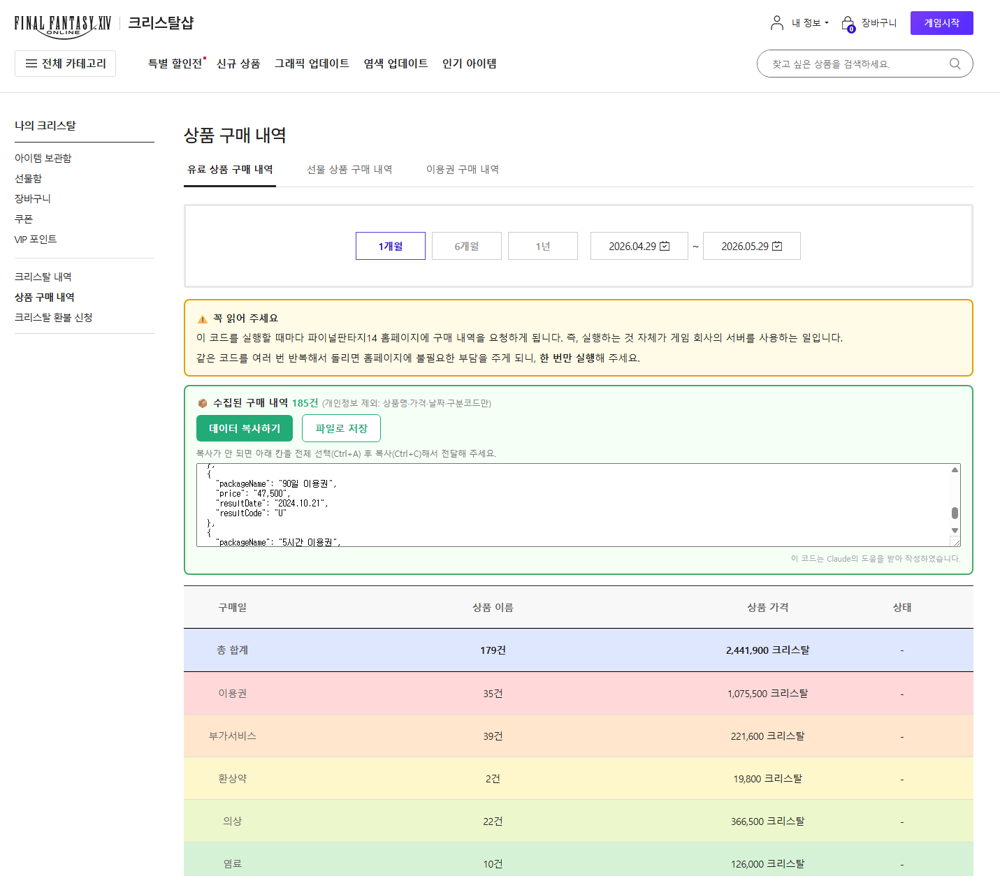

# 파이널판타지14 구매 내역 통계



파이널판타지14(FF14) 크리스탈샵의 **유료 상품 구매 내역**을 오픈 시점부터 현재까지 한 번에 불러와, 카테고리별(정액제·집사·의상·탈것 등)로 집계해 보여 주는 스크립트입니다.

> 이 코드는 Claude의 도움을 받아 작성하였습니다.

## 사용법

1. https://www.ff14.co.kr/shop/MyShop/BuyList 에 들어갑니다.
2. 파이널판타지14 홈페이지에 로그인합니다.
3. 개발자 도구를 열고 **Console** 탭에 아래 코드를 붙여넣은 뒤 엔터를 입력합니다.
   - 개발자 도구 열기: 키보드 `F12` (또는 Windows `Ctrl+Shift+I` / Mac `Cmd+Option+I`)
4. 코드가 다 실행될 때까지 잠시 기다립니다. **(중간에 새로고침 ❌)**
   - 구매 내역이 많으면 수십 초까지 걸릴 수 있습니다.
   - 표 위에 노란 안내 박스와 초록 박스가 나타나면 완료된 것입니다.

> ⚠️ 이 코드를 실행할 때마다 파이널판타지14 홈페이지에 구매 내역을 요청하게 됩니다.
> 즉, 실행하는 것 자체가 게임 회사의 서버를 사용하는 일입니다.
> 같은 코드를 여러 번 반복해서 돌리면 홈페이지에 불필요한 부담을 주게 되니, **한 번만 실행**해 주세요.

## (선택) 결과 데이터 공유

> 이 항목은 필수가 아닙니다. 통계만 확인하실 분은 건너뛰셔도 됩니다.

분류 정확도를 더 다듬는 데 여러 사람의 구매 내역 예시가 있으면 도움이 됩니다. 괜찮으시면 결과 데이터를 보내 주시면 감사하겠습니다.

실행이 끝나면 표 위 초록색 박스에 버튼 두 개가 나타납니다.

- **데이터 복사하기**: 구매 내역을 클립보드에 복사합니다.
- **파일로 저장**: 같은 내용을 `.json` 파일로 내려받습니다.

> 자동 복사가 안 되는 경우, 박스 안의 입력칸을 전체 선택(`Ctrl+A`)한 뒤 복사(`Ctrl+C`)하면 됩니다.

### 어떤 정보가 담기나요?

아래 **4가지 항목만** 담깁니다. 캐릭터명·서버 정보·선물 메시지 같은 개인정보는 일절 포함되지 않습니다.

| 항목          | 설명                                          |
| ------------- | --------------------------------------------- |
| `packageName` | 상품 이름                                     |
| `price`       | 가격 (크리스탈)                               |
| `resultDate`  | 구매 날짜                                     |
| `resultCode`  | 구분 코드 (이용권 / 부가서비스 / 청약철회 등) |

## 코드

```javascript
async function generateReceipt() {
  var $tbody = $("#dataList");
  if ($tbody.length === 0) {
    alert(
      "#dataList 를 찾을 수 없습니다. 상품 구매 내역 페이지에서 실행하세요.",
    );
    return;
  }

  // 분류 사전 위치 (본인 GitHub Pages)
  var PRODUCT_INFO_URL =
    "https://devhante.github.io/ffxiv-kr-shop-receipt/product-info.json";

  function toNum(v) {
    return parseInt(String(v == null ? 0 : v).replace(/,/g, ""), 10) || 0;
  }
  function comma(n) {
    return n.toString().replace(/\B(?=(\d{3})+(?!\d))/g, ",");
  }
  function pad(n) {
    return ("0" + n).slice(-2);
  }
  function stateLabel(code) {
    return (
      {
        R: "청약철회",
        U: "이용권",
        D: "계정 지급",
        I: "아이템 보관함",
        M: "모그레터 발송",
        S: "서버 이전 정보",
      }[code] || "부가서비스"
    );
  }

  $tbody.html('<tr><td colspan="4">분류 데이터 불러오는 중…</td></tr>');

  // ── 분류 사전 로드 ──
  var productMap = {};
  try {
    productMap = await (await fetch(PRODUCT_INFO_URL)).json();
  } catch (e) {
    alert("분류 데이터를 불러오지 못했습니다: " + e);
    return;
  }

  // product-info.json의 세부 분류 → 화면 표시용 12종으로 묶기
  var GROUP = {
    이용권: "이용권",
    환상약: "환상약",
    "집사 고용권": "부가서비스",
    "초코보 가방 이용권": "부가서비스",
    변경권: "부가서비스",
    의상: "의상",
    헤어카탈로그: "의상",
    "무기/패션 소품": "의상",
    "머리/장신구/얼굴 치장": "의상",
    염료: "염료",
    탈것: "탈것",
    "감정 표현": "감정 표현",
    "꼬마 친구": "꼬마 친구",
    "오케스트리온 악보": "오케스트리온 악보",
    하우징: "하우징",
    // 위 목록에 없는 분류(모험록·영원한 언약식·디지털 콜렉터·초코보 갑주·모험가 지원 세트 등)는 '기타'
  };

  // 사전에 상품명이 있으면 → 12종으로 묶기(없는 분류는 기타),
  // 사전에 상품명 자체가 없으면 → 미분류
  function categorize(name) {
    if (!name || !Object.prototype.hasOwnProperty.call(productMap, name))
      return "미분류";
    return GROUP[productMap[name]] || "기타";
  }

  // 12분류별 행 배경색
  // 이용권 → 하우징까지는 무지개색(빨강→보라) 순서로 부드럽게 배치
  var COLOR = {
    이용권: "#FFD9D9", // 빨강
    부가서비스: "#FFE6CC", // 주황
    환상약: "#FFF7CC", // 노랑
    의상: "#ECF7CC", // 연두
    염료: "#D6F2D6", // 초록
    탈것: "#CCF2EA", // 청록
    "꼬마 친구": "#CCE9F7", // 하늘
    "감정 표현": "#D6DDF7", // 파랑
    "오케스트리온 악보": "#E0D6F7", // 남색
    하우징: "#F2D6F2", // 보라
    기타: "#ECEFF1", // 회색빛
    미분류: "", // 색 없음
  };

  // ── 조회: 연 단위(서버 1년 제한) × 페이지네이션 ──
  var counts = {},
    values = {};
  var totalCount = 0,
    totalValue = 0,
    refundCount = 0,
    refundValue = 0;
  var etcNames = {},
    allRecords = [],
    detailRows = [];

  $tbody.html(
    '<tr><td colspan="4">전체 기간 조회 중… 잠시만 기다려 주세요.</td></tr>',
  );

  var now = new Date(),
    thisYear = now.getFullYear();
  for (var year = 2015; year <= thisYear; year++) {
    var startDate = year + "-01-01";
    var endDate =
      year === thisYear
        ? thisYear + "-" + pad(now.getMonth() + 1) + "-" + pad(now.getDate())
        : year + "-12-31";

    var pageNo = 1,
      maxPage = 300;
    while (pageNo <= maxPage) {
      var stop = false;
      $.ajax({
        url: "/shop/myShop/GetBuyListAdd",
        async: false,
        type: "post",
        data: { startDate: startDate, endDate: endDate, PageNo: pageNo },
        success: function (res) {
          var list = res && res.List ? res.List : Array.isArray(res) ? res : [];
          if (!list || list.length === 0) {
            stop = true;
            return;
          }

          for (var i = 0; i < list.length; i++) {
            var item = list[i];
            var name = item.packageName || "";
            var date = item.resultDate || "";
            var priceStr = item.price || "0";
            var priceNum = toNum(priceStr);
            var code = item.resultCode || "";

            allRecords.push({
              packageName: name,
              price: priceStr,
              resultDate: date,
              resultCode: code,
            });

            var bg;
            if (code === "R") {
              refundCount += 1;
              refundValue += priceNum;
              bg = "#F0F0F0";
            } else {
              var cat = categorize(name);
              counts[cat] = (counts[cat] || 0) + 1;
              values[cat] = (values[cat] || 0) + priceNum;
              totalCount += 1;
              totalValue += priceNum;
              if (cat === "미분류") etcNames[name] = (etcNames[name] || 0) + 1;
              bg = COLOR[cat] || "";
            }

            var rowHtml = bg ? '<tr style="background:' + bg + ';">' : "<tr>";
            rowHtml += "<td>" + date + ' <span class="mo"></span></td>';
            rowHtml +=
              '<td data-title data-padding3><span class="txt_c5" title="' +
              name +
              '"> ' +
              name +
              "</span></td>";
            rowHtml +=
              '<td class="txt_c5" data-price>' + priceStr + " 크리스탈</td>";
            rowHtml +=
              '<td class="txt_c5" data-state>' + stateLabel(code) + "</td>";
            rowHtml += "</tr>";
            detailRows.push({ date: date, html: rowHtml });
          }
        },
        error: function (xhr) {
          alert(xhr.responseText);
          stop = true;
        },
      });
      if (stop) break;
      pageNo++;
    }
  }

  // ── 합계 섹션 (표 맨 앞에 배치) ──
  // 계(총 합계) · 소계(분류별) · 세부사항을 가로 구분선으로 나눔
  var DIVIDER = "1px solid #000000";

  // (옵션) 윗변·아랫변 구분선을 붙여 4칸짜리 한 행 생성
  // cellStyle: 각 칸(td)에 직접 적용할 스타일 (txt_c5 클래스보다 우선)
  function sumRow(rowStyle, label, cnt, val, topLine, bottomLine, cellStyle) {
    var bd = cellStyle || "";
    if (topLine) bd += "border-top:" + DIVIDER + ";";
    if (bottomLine) bd += "border-bottom:" + DIVIDER + ";";
    return (
      '<tr style="' +
      rowStyle +
      '"><td style="' +
      bd +
      '">' +
      label +
      '</td><td class="txt_c5" style="' +
      bd +
      '">' +
      cnt +
      '</td><td class="txt_c5" style="' +
      bd +
      '">' +
      val +
      '</td><td class="txt_c5" style="' +
      bd +
      '">-</td></tr>'
    );
  }

  // 소계: 분류별 합계 + 청약철회
  var ORDER = [
    "이용권",
    "부가서비스",
    "환상약",
    "의상",
    "염료",
    "탈것",
    "꼬마 친구",
    "감정 표현",
    "오케스트리온 악보",
    "하우징",
    "기타",
    "미분류",
  ];
  var subRows = [];
  ORDER.forEach(function (cat) {
    if (counts[cat] > 0)
      subRows.push({
        style: "font-weight:bold;background:" + (COLOR[cat] || "#fafafa") + ";",
        label: cat,
        cnt: comma(counts[cat]) + "건",
        val: comma(values[cat]) + " 크리스탈",
      });
  });
  if (refundCount > 0)
    subRows.push({
      style: "font-weight:bold;background:#F0F0F0;color:#999;",
      label: "청약철회<br>(합계 제외)",
      cnt: comma(refundCount) + "건",
      val: comma(refundValue) + " 크리스탈",
    });

  // 계: 총 합계 — 윗변 구분선 + 글씨 강조 (소계가 없으면 아랫변도 구분선)
  var summaryHtml = sumRow(
    "font-weight:bold;font-size:1.08em;background:#dfe7ff;",
    "총 합계",
    comma(totalCount) + "건",
    comma(totalValue) + " 크리스탈",
    true,
    subRows.length === 0,
    "font-weight:bold;",
  );

  // 소계 첫 행 윗변(계와 구분) · 마지막 행 아랫변(세부사항과 구분)에만 구분선
  subRows.forEach(function (r, idx) {
    summaryHtml += sumRow(
      r.style,
      r.label,
      r.cnt,
      r.val,
      idx === 0,
      idx === subRows.length - 1,
    );
  });

  // ── 상세 구매 내역: 최근 구매가 위로 오도록 날짜 내림차순 정렬 ──
  function dateKey(s) {
    return String(s).replace(/\D/g, "");
  }
  detailRows.sort(function (a, b) {
    var x = dateKey(a.date),
      y = dateKey(b.date);
    return x < y ? 1 : x > y ? -1 : 0;
  });
  var detailHtml = detailRows
    .map(function (r) {
      return r.html;
    })
    .join("");

  $tbody.html(summaryHtml + detailHtml);

  // ── 미분류 목록 콘솔 출력 ──
  var etcList = Object.keys(etcNames).map(function (n) {
    return n + " (" + etcNames[n] + ")";
  });
  if (etcList.length > 0)
    console.log("[미분류 " + etcList.length + "종]\n" + etcList.join("\n"));
  else console.log("미분류 없음 — 모두 분류되었습니다.");

  // ── 안내 + 내보내기 박스 ──
  var exportJson = JSON.stringify(allRecords, null, 2);
  window.__ff14_export = allRecords;
  window.__ff14_etc = etcList;
  $("#ff14ExportBox").remove();
  $("#ff14NoticeBox").remove();

  var etcHtml =
    etcList.length > 0
      ? '<div style="margin-top:10px;color:#a33;font-size:12px;">사전에 없어 "미분류"로 처리된 상품 ' +
        etcList.length +
        "종이 있습니다 (콘솔에서 목록 확인 가능). product-info.json에 추가하면 분류됩니다.</div>"
      : "";

  var boxHtml =
    "" +
    '<div id="ff14NoticeBox" style="margin:16px 0 0;padding:14px 16px;border:2px solid #e0a000;border-radius:8px;background:#fffbe6;font-size:14px;line-height:1.6;">' +
    '  <div style="font-weight:bold;margin-bottom:6px;">⚠️ 꼭 읽어 주세요</div>' +
    "  <div>이 코드를 실행할 때마다 파이널판타지14 홈페이지에 구매 내역을 요청하게 됩니다. 즉, 실행하는 것 자체가 게임 회사의 서버를 사용하는 일입니다.</div>" +
    '  <div style="margin-top:6px;">같은 코드를 여러 번 반복해서 돌리면 홈페이지에 불필요한 부담을 주게 되니, <b>한 번만 실행</b>해 주세요.</div>' +
    "</div>" +
    '<div id="ff14ExportBox" style="margin:12px 0 16px;padding:16px;border:2px solid #4a6;border-radius:8px;background:#f6fff6;font-size:14px;">' +
    '  <div style="margin-bottom:10px;font-weight:bold;">📦 수집된 구매 내역 <span style="color:#2a7;">' +
    allRecords.length +
    '건</span> <span style="color:#888;font-weight:normal;font-size:12px;">(개인정보 제외: 상품명·가격·날짜·구분코드만)</span></div>' +
    '  <button id="ff14CopyBtn" type="button" style="cursor:pointer;padding:10px 18px;border:0;border-radius:6px;background:#2a7;color:#fff;font-size:14px;font-weight:bold;">데이터 복사하기</button>' +
    '  <button id="ff14DownBtn" type="button" style="cursor:pointer;margin-left:8px;padding:10px 18px;border:1px solid #2a7;border-radius:6px;background:#fff;color:#2a7;font-size:14px;font-weight:bold;">파일로 저장</button>' +
    '  <span id="ff14CopyMsg" style="margin-left:12px;color:#2a7;"></span>' +
    etcHtml +
    '  <div style="margin-top:10px;color:#777;font-size:12px;">복사가 안 되면 아래 칸을 전체 선택(Ctrl+A) 후 복사(Ctrl+C)해서 전달해 주세요.</div>' +
    '  <textarea id="ff14ExportArea" readonly style="margin-top:8px;width:100%;height:120px;font-family:monospace;font-size:12px;box-sizing:border-box;"></textarea>' +
    '  <div style="margin-top:10px;color:#aaa;font-size:11px;text-align:right;">이 코드는 Claude의 도움을 받아 작성하였습니다.</div>' +
    "</div>";

  var $anchor = $("table.tbl_type2").first();
  if ($anchor.length) $anchor.before(boxHtml);
  else $tbody.closest("table").before(boxHtml);
  $("#ff14ExportArea").val(exportJson);

  function showMsg(t) {
    $("#ff14CopyMsg").text(t);
    setTimeout(function () {
      $("#ff14CopyMsg").text("");
    }, 3000);
  }
  $("#ff14CopyBtn").on("click", function () {
    var ok = function () {
      showMsg("✅ 복사됨! (" + allRecords.length + "건)");
    };
    var fail = function () {
      var ta = document.getElementById("ff14ExportArea");
      ta.focus();
      ta.select();
      try {
        document.execCommand("copy");
        showMsg("✅ 복사됨! (" + allRecords.length + "건)");
      } catch (e) {
        showMsg("⚠️ 자동 복사 실패 — 아래 칸에서 직접 복사해 주세요.");
      }
    };
    if (navigator.clipboard && navigator.clipboard.writeText)
      navigator.clipboard.writeText(exportJson).then(ok).catch(fail);
    else fail();
  });
  $("#ff14DownBtn").on("click", function () {
    var blob = new Blob([exportJson], { type: "application/json" });
    var url = URL.createObjectURL(blob);
    var a = document.createElement("a");
    a.href = url;
    a.download =
      "ff14_buylist_" + new Date().toISOString().slice(0, 10) + ".json";
    document.body.appendChild(a);
    a.click();
    document.body.removeChild(a);
    URL.revokeObjectURL(url);
    showMsg("💾 파일 저장됨");
  });
}

generateReceipt();
```
